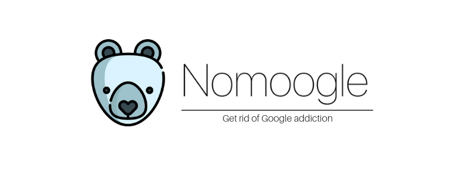

## Nomoogle
 A simple Chrome extension that can help you get rid of Google addiction.

## Installation
1. Clone or Download the repo.
2. Go to Extension settings
3. Enable Developers Mode
4. Click on "Load Unpackaged" and add the folder you downloaded.

## Features

1. Get google alternatives in one click

    

	
2. Get popup Reminder, Everytime you use a google product

    

3. With two special modes 

    

 
 **Strict Mode**: Block the entire webpage completly, doesn't allow you to move forward.

 **Redirects**: Automatically redirects the page to popular alternative.

 ## Thanks to
 ❤️ Special thanks to [@levelsio](https://twitter.com/levelsio). 🙅‍♀️ [Nomoregoogle](nomoregoogle.com) was an inspiration for this.

 ## License
 MIT License

